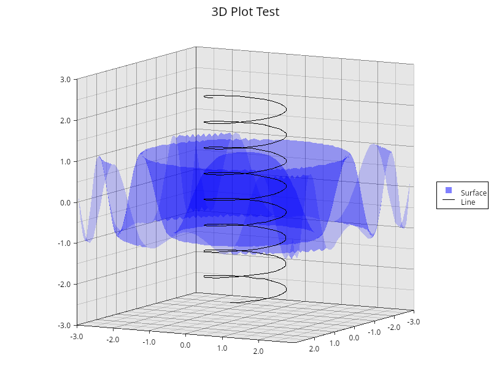

# skia-plotters-backend

[skia-safe](https://github.com/rust-skia/rust-skia) backend for [plotter-rs](https://github.com/plotters-rs/plotters). Experimental phase.



### Installation

```sh
cargo add skia-plotters-backend
```

### Demo

```sh
cargo run --example demo
# Open demo.png
```